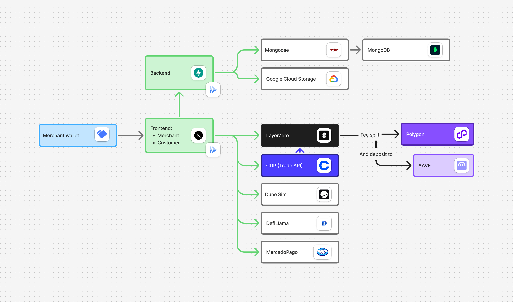

# PayAnyWhere Frontend

## Overview

This frontend is part of the PayAnyWhere monorepo and provides:

* A **merchant dashboard** for managing payments and balances.
* A **client payment interface** for scanning QR codes and completing transactions.
* A consistent, responsive design built with **Next.js**, **TypeScript**, and **TailwindCSS**.



## Tech Stack

* **Framework:** [Next.js 16](https://nextjs.org/)
* **Language:** [TypeScript](https://www.typescriptlang.org/)
* **Styling:** [TailwindCSS](https://tailwindcss.com/)
* **Formatter & Linter:** [Biome](https://biomejs.dev/)
* **Package Manager:** Yarn
* **Build Output:** Standalone (for container deployment)

## Getting Started

### 1. Install Dependencies

```bash
yarn install
```

### 2. Run the App

```bash
yarn dev
```

Visit: [http://localhost:3000](http://localhost:3000)


## Code Quality

Code formatting and linting are managed with **Biome**.

### Commands

```bash
yarn biome
yarn biome:fix
```